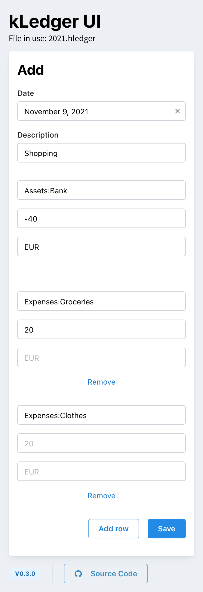
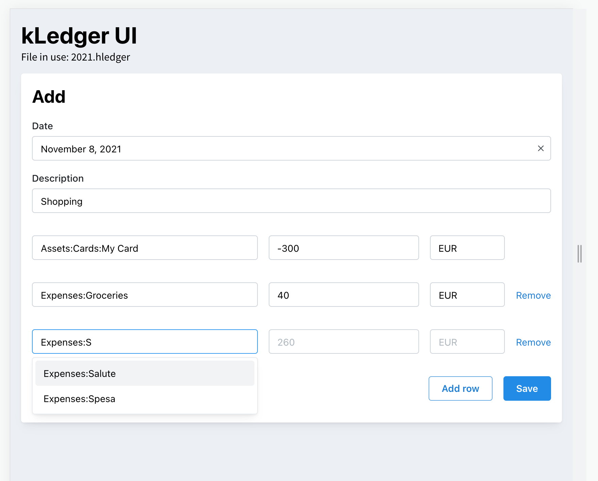

# kLedger-ui

[](https://app.travis-ci.com/kajyr/k-ledger-ui)

k-ledger-ui is a mobile oriented web app that I quickly made to help me use my plain text accounting journal when travelling, with just a mobile device.

Currently it just supports adding a simple transaction: it suggests the remaining amount to balance, but it will actually accept an unbalanced transaction.

It suggests also already used accounts and commodities, to make typing from a mobile faster.

## Setup

The easiest way to run this app is by using Docker.

You can run:

```
docker run -d \
	-v "<your folder>:/app/data" \
	-e K_LEDGER_FILE="/app/data/<your file>"  \
	-p 4445:4445 kajyr/k-ledger-ui
```

Then you can browse `http://<your IP>:4445` or even better, setup nginx proxy and https.

## Screenshots

|    Mobile viewport     |    Tablet viewport     |
| :--------------------: | :--------------------: |
|  |  |
